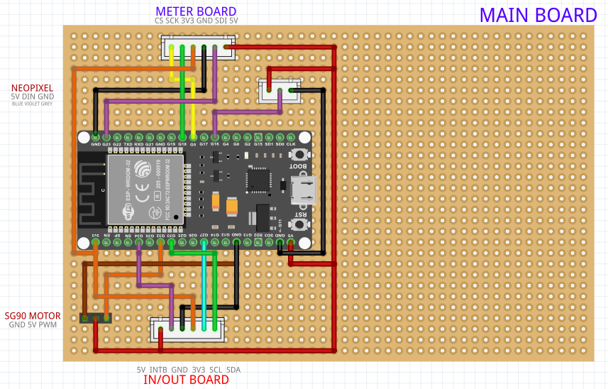
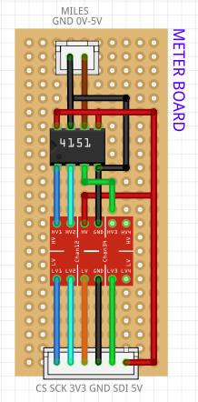
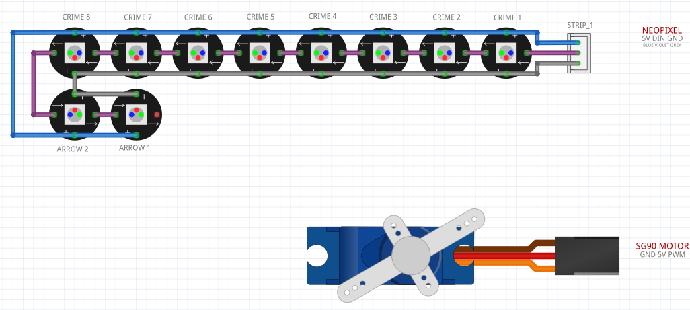

# Dr. Moratorius' Holmes-O-Matic

This is a repository explaining how I built my Holmes-O-Matic and also provides 
all of the required files and information.
Please note that this is more a repository that can help you build your own
or adapt it and not a full tutorial.

## Features
* Powered by USB (power bank) connected to the ESP32 or via a DIY-18650 mini power bank.
* Powered by an ESP32 WROOM-32 using MicroPython
* Wooden Backpack

## Functionality
This project represents the Holmes-O-Matic, which is a Victorian-style device that detects crimes
nearby through the ether using the built-in antennas. When a crime is detected, the corresponding 
crime light will be illuminated and the hand will point on it and the distance from it will be shown on an illuminated analog meter. Also, the arrows will point into the direction of the crime.
There's also a manual mode that when enabled by the press of the button will illuminate all of the
lights in random colors for some time.
Please note that as this is a 180° servo not all 8 crimes will be reachable.

## Schematic
The project is comprised of three boards:

### 1. Main Board
Contains the ESP32 and connectivity to the other two boards and the WS2812B LEDs and the SG90 servo motor.

### 2. Meter Board
The project includes a 5V voltmeter. This board therefore needs to run with 5V and is used to create a voltage between 0 and 5V. However, as the ESP32 utilized 3V3 GPIOs logic level converters are used.

### 3. In/Out Board
This port utilizes an MCP23017 and an ULN2803A and also a logic level converter again. This board therefore features potentially eight inputs (out of which two are used: one for the switch to manual mode
and one for the manual mode trigger button) and eight outputs four of which are used for dynamically controlling the lanterns, the meter illumination and the LED in the top right.

### 4. Components
The SG90 servo motor and the diy WS2812B (neopixel) light strip are connected directly to the board.

## Components
* [parts list](docs/PARTS.MD)
* [labels (DOCX)](docs/Schilder.docx)
* [vial holder outer part pattern](docs/Schnittmuster.pdf) - print 100% (do not resize to printer edges) - does not fully cover outer part, but sufficient
* 3D printer files
  * [Large Cog Wheel - STL](3d/16cm_Cog_Wheel.stl) 
  * [Arrow - STL](3d/Arrow.stl)
  * [Navigator - STL](3d/Navigator.stl)
  * [Light Holder - STL](3d/Light_Holder.stl)
  * [Light Holder Cap - STL](3d/Light_Holder_Cap.stl)
  * [SG90 Hand - STL](3d/SG90_Hand.stl)
  * [SG90 Holder - STL](3d/SG90_Holder_Back.stl)
  * [Sign "Holmes-O-Matic" - STL](3d/sign_Holmes-O-Matic.stl)
  * [Tube Socket - STL](3d/Tube_Socket.stl)
* [Fritzing breadboard layout](fritzing/Moratorius-Holmes-O-Matic.fzz) - still missing schematic, tube lights not included (simply to flickering orange LEDs connected with 470R resistors to 5V and GND pins)

## Software
* The code uses the (latest MicroPython firmware for the ESP32)[https://micropython.org/download/ESP32_GENERIC/] and is flashed using (esptool.py)[https://docs.espressif.com/projects/esptool/en/latest/esp32/]
* The source code is available in the `src` directory
* Potential ideas for the future: allow control via smartphone through a WiFi AP

## Documents
You can find the printables for the signs and lights fully customizable in the (docs)[docs directory]. The crime images are all AI-generated and free to use.

## Partical Notes
If you use a power bank please keep in mind that most turn off completely if the attached device
does not use a lot of power requiring you to open the case and turn on the powerbank again.

## Logo
* Font: Stone Board (LOGO) https://dirtylinestudio.com/product/stone-board/
* Font: Stanford Breath (Text) https://befonts.com/stanford-breath-font.html
* Font to STL: https://text2stl.mestres.fr/
